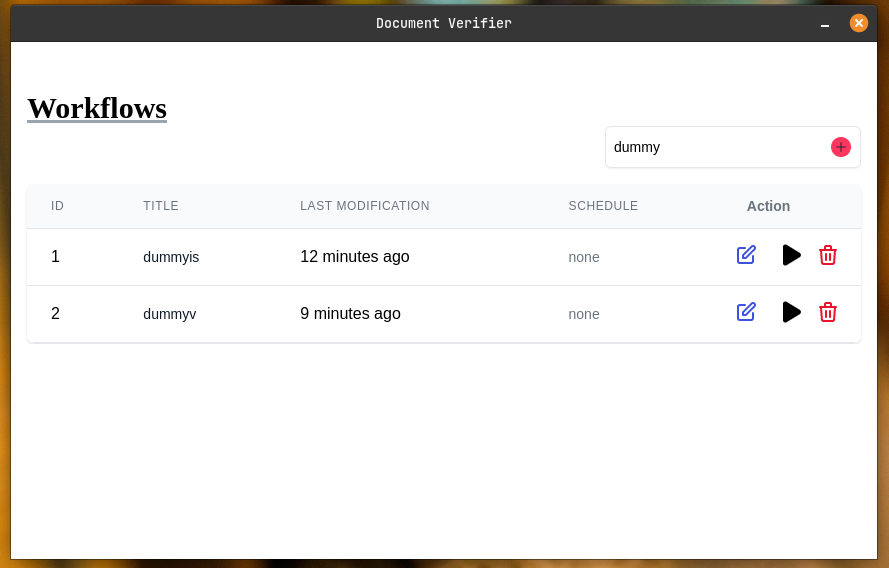
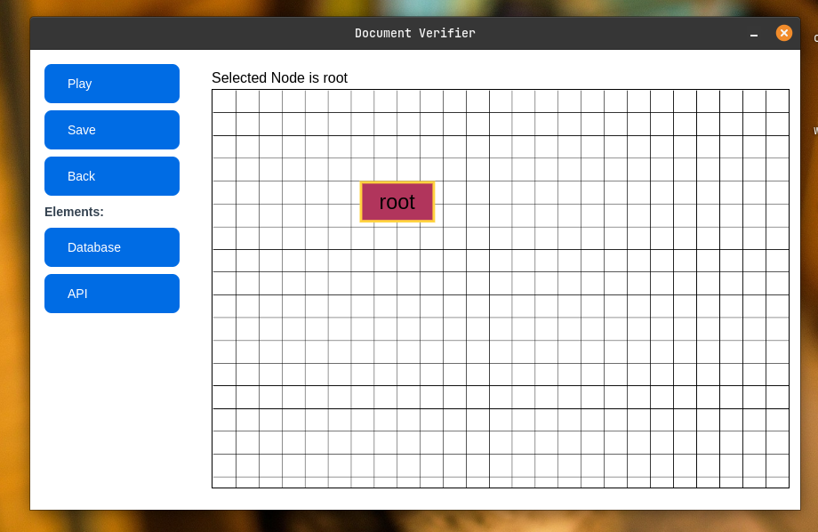
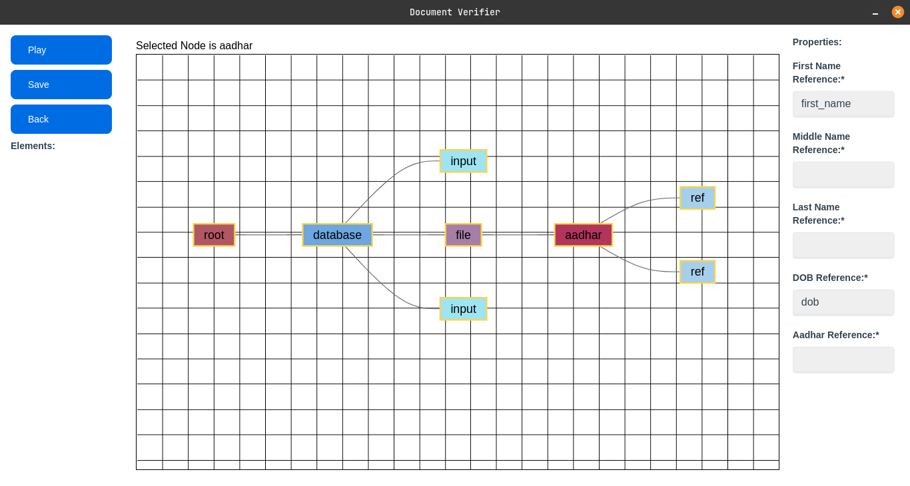
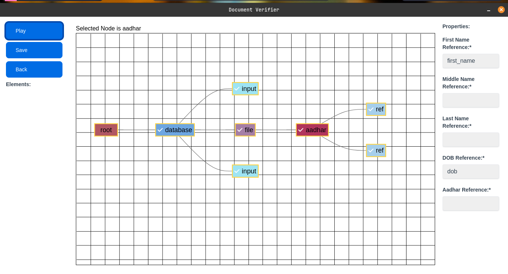

# Document Verifier

## Overview

Document Verifier is a web application that allows users to verify the authenticity of their documents. The app uses advanced algorithms to analyze the document and provide a report on its validity.

## Features

- Easy to use interface
- Fast and accurate document analysis
- Secure document verification process
- Modular and Easy Interface

## Technologies Used

- Angular
- Electron.js

## Installation

To install the app, follow these steps:

1. Clone the repository
2. Install the dependencies using npm
3. Start the app using the command 'npm run electron:local'

## Screenshots

## License

This project is licensed under the MIT License. See the LICENSE file for details.
